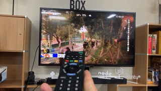

# NowPi

看 NowTV 新聞台是不是只有訂戶才能享用的特權？

當然不是！其實網上早有 NowTV 新聞台直播，但仍然有不少人習慣看家裡的大電視，如果沒有安裝 NowTV 或有線電視，那麼新聞台的選擇就只有 83 台，即使知道以 HDMI 或 Chromecast 接駁電腦能夠看到其他頻道甚至 Facebook Live，繁複的設置也往往令人卻步。

今天，我們釋出讓大家把網上的 NowTV 新聞台無縫連接上電視的 Source Code，為自己、為家人，輕鬆添置多一個新聞台選擇！

## 功能

- [x] 連接 NowTV 新聞台/直播台
- [x] 映像檔建立
- [x] 一插即用
- [x] HDMI-CEC 設定 Wi-Fi
- [x] HDMI-CEC 轉台 (同時支援新聞台/直播台)



## 製造自己的 NowPi

1. 下載最新的 [映像檔](https://github.com/teckyio/nowpi/releases/download/v0.1.2/nowpi-0.1.2.img.zip)。

2. 使用 [balenaEtcher](https://www.balena.io/etcher/) 去燒錄映像至 MicroSD Card。

3. 假若電視支援 HDMI-CEC （大部份電視都支援），直接把 MicroSD Card 插入 Raspberry Pi，接駁上電視和電源，按著畫面指示設定 Wi-Fi，便大功告成！

4. 假若電視未有支援 HDMI-CEC，可按我們的 [Blog 教學](https://tecky.io/en/%E5%88%A9%E7%94%A8-Raspberry-Pi-%E6%8E%A5%E9%A7%81-NowTV-%E6%96%B0%E8%81%9E%E5%8F%B0%E4%B8%8A%E9%9B%BB%E8%A6%96/) 去設定 Wi-FI。

## 開發者專用: 建立自己的映像檔

如果你希望協助我們開發更好的 NowPi，或者想建立自己的 NowPi 看看其他新聞頻道，可按以下步驟建立映像檔：

#### 系統需求

* Ubuntu 18.04 LTS 或以上
* node.js 10 或以上
* yarn 

#### 步驟

1. 從 https://www.raspberrypi.org/downloads/raspbian/ 下載最新的 Raspbian Buster with desktop。

2. 執行：

```bash
cd nowpi
yarn
yarn build
cd ..
sudo bash build-image.sh [Raspbian的映像檔] nowpi.img
```

## 授權

本軟件以 [GPL v3](https://opensource.org/licenses/gpl-3.0.html) 開源授權，詳情請參閱 [LICENSE](./LICENSE) 檔。